% [Molecular Modelling][] [Practicum][]
% Lukas Waymann

[Molecular Modelling]: http://www.bisb.uni-bayreuth.de/Lecture/
[Practicum]: http://www.bisb.uni-bayreuth.de/Lecture/practical/practical.html

---
subtitle: Protocol
...

# CHARMM^[<http://www.bisb.uni-bayreuth.de/Lecture/practical/CharmmCourse/Skript/index.html>]

```
                            /---------\
                           /           \
                          /             \
                         /               \
                         !  XXXX   XXXX  !
                         !  XXXX   XXXX  !
                         !  XXX     XXX  !
                         !       X       !
                          --\   XXX   /--
                           ! !  XXX  ! !
                           ! !       ! !
                           ! I I I I I !
                           !  I I I I  !
                            \         /
                             --     --
                               \---/
                        XXX             XXX
                       XXXX             XXXX
                       XXXXX           XXXXX
                          XXX         XXX
                            XXX     XXX
                               XXXXX
                              XXX XXX
                            XXX     XXX
                          XXX         XXX
                       XXXXX           XXXXX
                       XXXX             XXXX
                        XXX             XXX
```

```bash
$ type charmm
charmm is aliased to `/sw/sci/bin/x86_64-linux/charmm.28'
```

## Theoretical Background - Molecular Dynamics simulations^[<http://www.bisb.uni-bayreuth.de/Lecture/practical/CharmmCourse/Skript/node1.html>]

### Time evolution^[<http://www.bisb.uni-bayreuth.de/Lecture/practical/CharmmCourse/Skript/node8.html>]

<!--
#### The Verlet algorithm

<http://www.bisb.uni-bayreuth.de/Lecture/practical/CharmmCourse/Skript/node9.html>
-->

#### The Verlet algorithm[^node9]

**Questions and answers.**

>   Explain briefly the components of a typical energy function.

There are five components:

*   [Bond stretching](http://www.bisb.uni-bayreuth.de/Lecture/practical/CharmmCourse/Skript/node3.html)
    *   Represents covalent bonds between atoms.
    *   Energy is based on the deviation from the ideal distance between atoms.
    *   Usually sufficient to use harmonic approximation.
*   [Angle bending](http://www.bisb.uni-bayreuth.de/Lecture/practical/CharmmCourse/Skript/node4.html)
    *   Energy resulting from the angle between any two atoms bound to the same atom.
*   [Torsion angles](http://www.bisb.uni-bayreuth.de/Lecture/practical/CharmmCourse/Skript/node5.html)
    *   Rotation of atom groups around a given bond.
*   [Van-der-Walls terms](http://www.bisb.uni-bayreuth.de/Lecture/practical/CharmmCourse/Skript/node6.html)
    *   Forces not based on covalent or ionic bonds.
    *   Can be approximated by a Lennard-Jones 12-6 potential.
*   [Electrostatic term](http://www.bisb.uni-bayreuth.de/Lecture/practical/CharmmCourse/Skript/node7.html)
    *   Non-bonded interactions.
    *   Number of terms is $O(n^2)$ for $n$ atoms.
    *   Cutoff distance can be used to bound computational complexity.

>   Explain the basic ideas underlying the Steepest Descent and Newton Raphson algorithms.

*   Steepest Descent
    *   Finds a local minimum.
    *   Start with some coordinates on the energy landscape.
    *   Successively move a discrete amount along the local downhill gradient (the
        steepest descent).
*   Newton
    *   **TODO.**

>   Explain how the energy function can be used to obtain the dynamics of a protein
>   (Molecular Dynamic Simulation).

*   The force exerted on an any atom can be obtained by taking the derivative of the
    energy function.
*   Newton's second law gives us accelerations.
*   Numerical integration can be used to get approximate trajectories.

>   A typical MD Simulation protocol follows four steps: Initialization, Heating,
>   Equilibration and Production.  What is done in these steps and why is that necessary?

After getting a file describing the structure of a molecule (for example from the
[Protein Data Bank][PDB]), these steps may be performed:

[PDB]: http://www.rcsb.org/pdb

*   Initialization^[<http://www.bisb.uni-bayreuth.de/Lecture/Slides/lecture-md.pdf#page=19>]
    *   Add missing hydrogen atoms.
    *   Split the structure into connected segments (partition the [.pdb] file into
        several ones).
    *   Adjust atom names to match those found in the [topology
        file][top_all27_prot_lipid.rtf].
        *   Edit one or the other file.
    *   Add non-standard covalent bonds.
    *   Add water.
    *   Molecule's initial coordinates cause high energies and forces.

[.pdb]: https://en.wikipedia.org/wiki/Protein_Data_Bank_(file_format)

*   Heating

    *   The molecule should have a realistic temperature (based on its natural
        environment).

*   Equilibration

    *   The atoms' velocities are rescaled until the system is thermodynamic
        equilibrium, while keeping the temperature constant.
    *   This ensures that the temperature won't change when simulating the system.

*   Production

    *   This is the actual simulation.
    *   The observed trajectories are analysed; for example to learn about the molecules
        flexibility.

### [Running CHARMM][]

>   Explain briefly which informations are stored in the parameter and topology file.

*   [Parameter file][par_all27_prot_lipid.prm]
    *   Bond force constants and equilibrium geometries.
    *   Binding angles.
    *   Dihedral angles (torsion angles).
    *   All other numerical constants needed to evaluate forces and energies.
    *   We use `/sw/sci/app/charmm/c32b1/toppar/par_all27_prot_lipid.prm`.
*   [Topology file][top_all27_prot_lipid.rtf]
    *   Definitions of biomolecules.
        *   [Structural formuae](https://en.wikipedia.org/wiki/Structural_formula).
        *   Atom types.
    *   We use `/sw/sci/app/charmm/c32b1/toppar/top_all27_prot_lipid.rtf`.

>   Explain briefly what atom types are and why they are needed?

*   Different sets of parameters have to be used to simulate, e.g., a hydrogen atom
    bonded to a carbon atom and one bonded to oxygen.
*   This is called the chemical environment and represented by *atom types*.
*   Each atom can have different types to model its chemical environment.

>   How many atom types are there in an alanine residue?

The definition of the alanine residue in the [topology file][top_all27_prot_lipid.rtf]
is

    ...
    GROUP
    ATOM CB   CT3    -0.27
    ATOM HB1  HA      0.09
    ATOM HB2  HA      0.09
    ATOM HB3  HA      0.09
    GROUP
    ...
Thus, there are two atom types: `CT3` and `HA`.

>   What is the partial charge of the hydrogen (HS/HG1) atom and the sulfur atom (S/SG)?

In the [topology file][top_all27_prot_lipid.rtf] we find:

    RESI CYS          0.00
    ...
    ATOM SG   S      -0.23
    ATOM HG1  HS      0.16
    ...

Knowing that "[t]he numerical value [...] defines the partial charge"[^node11], we see
that the sought after values are `0.16` and `-0.23`, respectively.

[^node11]: <http://www.bisb.uni-bayreuth.de/Lecture/practical/CharmmCourse/Skript/node11.html>

>   What are the parameters for the sulfur-hydrogen bond (S-HS)?

```bash
$ grep BONDS -A 7 par_all27_prot_lipid.prm; grep '^S.*HS' par_all27_prot_lipid.prm
BONDS
!
!V(bond) = Kb(b - b0)**2
!
!Kb: kcal/mole/A**2
!b0: A
!
!atom type Kb          b0
S    HS    275.000     1.3250 ! ALLOW   SUL ION
```

Thus, the force constant K~b~ for [equation 1][node3] is 275
$\frac{\text{kcal}}{\text{mole}\cdot \text{Å}^2}$ and the equilibrium bond length r~eq~
for [equation 1][node3], which corresponds to `b0`, is 1.325 Å.

[node3]: http://www.bisb.uni-bayreuth.de/Lecture/practical/CharmmCourse/Skript/node3.html

>   What are the parameters for the sulfur-sulfur bond (SM-SM)?

K~b~ is 173 and r~eq~ is 2.029:

```bash
$ grep -m 1 'SM.*SM' par_all27_prot_lipid.prm
SM   SM    173.000     2.0290 ! ALLOW   SUL ION
```

>   Which bond is harder to stretch?

Looking at [equation 1][node3] again, we can see that the energy required to stretch a
bond is directly proportional to its K~b~ value, so the sulfur-hydrogen bond is harder to
stretch.

[Running CHARMM]: http://www.bisb.uni-bayreuth.de/Lecture/practical/CharmmCourse/Skript/node13.html

## Initialization^[<http://www.bisb.uni-bayreuth.de/Lecture/practical/CharmmCourse/Skript/node14.html>]

### Structure preparation^[<http://www.bisb.uni-bayreuth.de/Lecture/practical/CharmmCourse/Skript/node15.html>]

**Questions and answers.**

>   Which method was used to determine the structure `1BPI.pdb` experimentally?

[X-ray diffraction][1BPI].

>   Are there other methods to determine experimentally the structure of a protein?

Other methods include [NMR spectroscopy and electron
microscopy](http://www.bisb.uni-bayreuth.de/Lecture/Slides/lecture-intro.pdf#page=23).

>   How many cysteines?  What are their residue numbers?

6 cysteines with residue numbers 5, 14, 30, 38, 51, and 55:

```bash
grep CYS 1bpi.pdb
```

>   What is the resolution of this structure of BPTI?

[1.09 Å][1BPI].

>   Are there disulfide-bridges in BPTI?

Yes:

```bash
$ grep '^SSBOND' 1bpi.pdb
SSBOND   1 CYS A    5    CYS A   55                          1555   1555  2.01
SSBOND   2 CYS A   14    CYS A   38                          1555   1555  2.03
SSBOND   3 CYS A   30    CYS A   51                          1555   1555  2.02
```

>   Which temperature was used for the measurements?

[125 K][1BPI].

>   Why are the hydrogen atoms missing?

<!-- TODO -->
Reduces visual clutter and they can be inferred from the incomplete structure easily?

### Minimization^[<http://www.bisb.uni-bayreuth.de/Lecture/practical/CharmmCourse/Skript/node16.html>]

**Questions and answers.**

>   Why are there high-energy interactions in the crystal structure?

The molecule may not be in the ideal conformation with respect to minimizing the internal
energy.

>   Why do they have to be removed?

*   Minima of the energy landscape correspond to stable conformations.
*   Should reduce vibrations in the dynamics simulation.
*   Should get us closer to naturally occurring conformations.
<!-- http://www.bisb.uni-bayreuth.de/Lecture/Slides/lecture-mini-nma.pdf#page=16 -->

>   How much would you expect the atomic coordinates to change during the minimization?

*   Depends on how close the conformation of the downloaded molecule structure is to an
    energy minimum.
*   Having removed the external water may cause considerable changes.

<!-- http://pandoc.org/MANUAL.html#ending-a-list -->

**Steps performed:**

1.  Copied (one of) the example input script(s) (`6b30b77`):

        $ cp /home/ullmann/Lecture16/PraktMolmod/CharmmCourse/example.inp .
2.  CHARMM failed to run with the provided parameter and topology files.  Apparently they
    are incompatible to the version we use.  `f21042d` adds compatible versions of both
    files called `par_all27_prot_na.inp` and `top_all27_prot_na.inp`, respectively.
3.  Modified `example.inp`.
4.  Ran:

    ```bash
    $ charmm < example.inp > charmm.out
    $ grep 'MINI>' charmm.out > mini.dat
    $ cat mini.dat
    MINI>        0  22814.35962      0.00000    503.70666      0.02000
    MINI>       10    283.03855  22531.32107     94.21325      0.02150
    MINI>       20   -610.28235    893.32089      6.14155      0.00401
    MINI>       30   -685.00044     74.71810      6.92729      0.00431
    MINI>       40   -742.50682     57.50638      1.95547      0.00193
    MINI>       50   -765.12952     22.62270      0.95290      0.00087
    MINI>        0   -765.12952     22.62270      0.95290      0.00000
    MINI>       10   -854.10369     88.97418      1.13469      0.04783
    MINI>       20   -895.41981     41.31612      1.06149      0.04633
    MINI>       30   -911.70797     16.28816      0.68017      0.02692
    MINI>       40   -919.90921      8.20124      0.64534      0.02607
    MINI>       50   -927.86086      7.95165      1.20517      0.03741
    ```
5.  Edited the step numbers in `mini.dat` to get a continuous plot (and removed the first
    line from ABNR minimization):

    ```bash
    $ cat mini.dat
    MINI>        0  22814.35962      0.00000    503.70666      0.02000
    MINI>       10    283.03855  22531.32107     94.21325      0.02150
    MINI>       20   -610.28235    893.32089      6.14155      0.00401
    MINI>       30   -685.00044     74.71810      6.92729      0.00431
    MINI>       40   -742.50682     57.50638      1.95547      0.00193
    MINI>       50   -765.12952     22.62270      0.95290      0.00087
    MINI>       60   -854.10369     88.97418      1.13469      0.04783
    MINI>       70   -895.41981     41.31612      1.06149      0.04633
    MINI>       80   -911.70797     16.28816      0.68017      0.02692
    MINI>       90   -919.90921      8.20124      0.64534      0.02607
    MINI>      100   -927.86086      7.95165      1.20517      0.03741
    ```
6.  Plotted `mini.dat` with Grace:

    ```bash
    $ xmgrace mini.dat
    ```
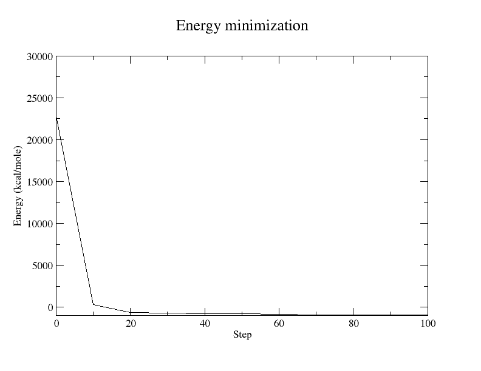\ 

7.  Increased the number of minimization steps in `example.inp` to 500 [SD][] and 1000
    ABNR (`78072be`), ran CHARMM again, `grep`ed its output, adjusted the step numbers,
    and plotted with Grace:

    ```bash
    $ charmm < example.inp > charmm-more-steps.out
    $ grep 'MINI>' charmm-more-steps.out > mini2.dat
    $ # Edit step numbers in mini2.dat
    $ xmgrace mini2.dat
    ```
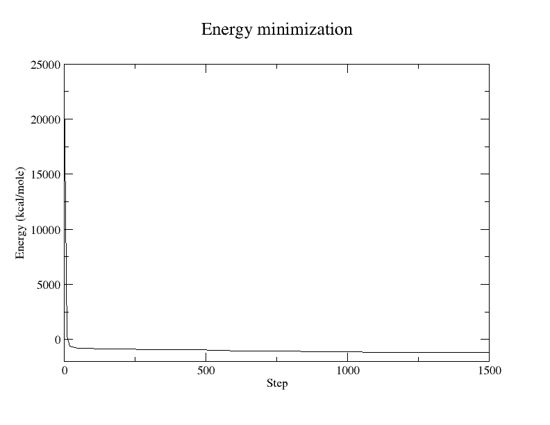\ 

[SD]: http://www.bisb.uni-bayreuth.de/Lecture/Slides/lecture-mini-nma.pdf#page=10

<!-- http://pandoc.org/MANUAL.html#ending-a-list -->

**Questions and answers.**

>   Has the energy converged?

Yes.

>   Compare the tow [sic] energy minimizations using XMGRACE.

See the plots above.  Minimizing with more steps still reduced the energy considerably.

>   Examine the pdb file before and after energy minimization using vmd before and after
>   energy minimization.  Notice any differences?

*   Hydrogen atoms were added by CHARMM.
*   The conformation changed considerably.
*   See the image below for the minimized molecule (with hydrogens atoms hidden) alongside
    the not minimized one.

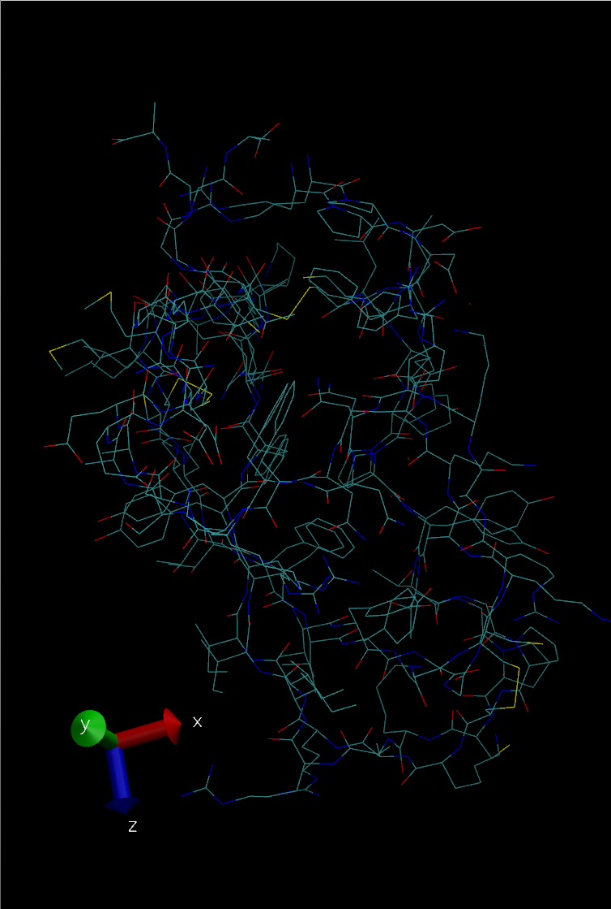

>   Calculate the RMSD using vmd or check the CHARMM output file for the RMSD.  How does
>   it compare to the resolution of your crystal?  What does RMSD mean?  Why is the RMSD
>   used to examine structures?

The RMSD is about 1.98 <!-- Exact value: 1.9818568887848576 -->. That's roughly twice the
resolution of the crystal.  RMSD stands for root-mean-square deviation; it serves as a
one-number metric for how much the structure changed.

>   What is the largest gradient during any of the minimizations?

The largest gradient occurs during the first 10 steps in both minimizations.  It's about
$2253 \frac{kcal}{mole}$ per step for both.

>   Plot the van-der-Waals and the electrostatic energy against the minimization steps
>   (`grep 'MINI EXTERN>' name.out > name.dat`; look in the CHARMM output for the
>   corresponding columns.). Compare the change of these energies to the change of the
>   total energy during the minimization.

```bash
$ grep 'MINI EXTERN>' charmm-more-steps.out > mini-extern.dat
$ # Merge the lines of mini2.dat and mini-extern.dat (after deleting line 52),
$ # and select 4 columns: step number, total energy, van der Waals energy, and
$ # electrostatic energy:
$ paste mini2.dat <(sed 52d mini-extern.dat) | awk '{print $2,$3,$9,$10}' > mini-merged.dat
$ xmgrace
```

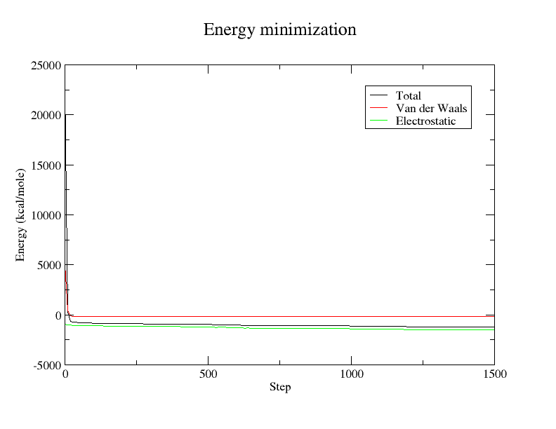\ 

### Changing the topology of a protein^[<http://www.bisb.uni-bayreuth.de/Lecture/practical/CharmmCourse/Skript/node17.html>]

```bash
$ charmm < example.inp > charm-disu.out
$ grep 'MINI>' charm-disu.out > mini-disu.dat
```

**Questions and answers.**

>   Look in data/top.inp for the PATCH DISU. What does it do?

The `patch disu` command adds disulfide bridges.  It modifies the PSF (Protein Structure
File).

>   What effect do the disulfide bridges have on the total energy?

They decrease it slightly:^[-1194.80087 and -1230.54878 are the total energies.]


```bash
$ tail -1 mini2.dat
MINI>     1500  -1194.80087      0.05653      0.04954      0.00167
$ tail -1 mini-disu.dat
MINI>     1500  -1230.54878      0.04196      0.04417      0.00175
```

>   Can you explain this effect? (It might be helpful to compare the energy decomposition,
>   the van-der-Waals and electrostatic energy, for the minimization with and without
>   disulfide-bridges)

The disulfide bridges stabilize the molecule.

### Interaction Energies^[<http://www.bisb.uni-bayreuth.de/Lecture/practical/CharmmCourse/Skript/node18.html>]

```bash
$ charmm < int-energy.inp
```

>   Explain what the `sele` (select) and the `sele .not.` command selects.

1.  The 3 atoms of one of the H~2~O molecules.
2.  All other atoms.

>   Which water molecule has the most favorable interaction energy?

The one with `resid` 62.

*   $-31.30 \frac{kcal}{mole}$.

## Heating^[<http://www.bisb.uni-bayreuth.de/Lecture/practical/CharmmCourse/Skript/node19.html>]

*   Create `dyna/` and copy files (02380b8 and d4ef929).
*   `$ cd dyna`
*   Edit `dyna/heat.inp` (f7d4fee).
*   `$ charmm < heat.inp  > heat.out`
*   `$ grep 'DYNA>' heat.out > heat.dat`
*
```bash
$ awk '{print $3"    "$4}' heat.dat > time-total.dat
$ awk '{print $3"    "$5}' heat.dat > time-kinetic.dat
$ awk '{print $3"    "$6}' heat.dat > time-potential.dat
$ awk '{print $3"    "$7}' heat.dat > time-temp.dat
```

>   Plot the total, potential and kinetic energy and the temperature versus simulation
    time (Remark: use `grep 'DYNA>' name.out > name.dat`).

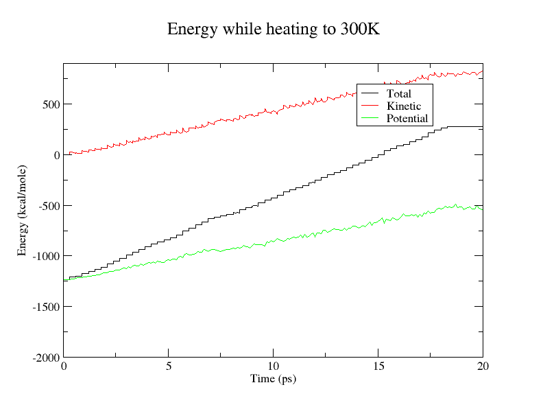\ 

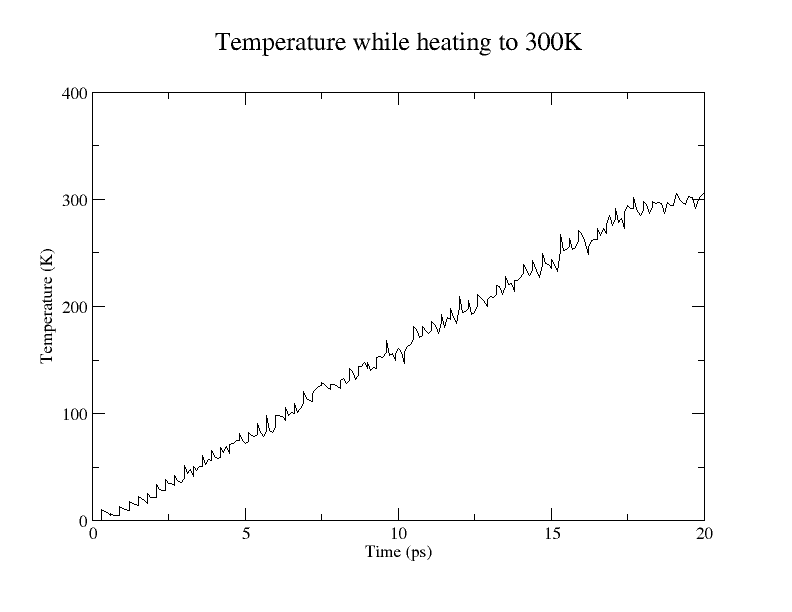\ 

The results for heating 250K, 273K and 400K are very similar.

>   Explain the shape of the temperature curve.

The curve is roughly linear until reaching 300K (as expected) but has lots of small
fluctuations.  These arise because:

1.  The system is heated in discrete steps.
2.  The system isn't in thermodynamic equilibrium: kinetic energy is constantly converted
    into potential energy.
3.  Potential energy comes not only from temperature but also from physical force fields
    within the system, which one contributes how much varies as the system's conformation
    changes.

>   What is the relation between the total, potential and kinetic energy?

Plus.

>   Calculate the RMSD between the hot and the cold protein.

| Temperature | RMSD   |
|-------------+--------|
| 250K        | 1.5662 |
| 273K        | 1.5662 |
| 300K        | 1.3909 |
| 400K        | 1.3019 |

Table: RMSDs

>   Compare the hot with the cold protein structure.

The structure changed slightly.  Some residues turned.

## Equilibration^[<http://www.bisb.uni-bayreuth.de/Lecture/practical/CharmmCourse/Skript/node20.html>]

### Equilibration with rescaling velocities^[<http://www.bisb.uni-bayreuth.de/Lecture/practical/CharmmCourse/Skript/node21.html>]

```bash
$ pwd
/home/student10/practicum/equi
$ git show -q | head -1
commit 77220dd5f078a4bba7cb9330a27416abb647dbe4
$ charmm < equi.inp > equi.out
$ grep 'DYNA>' equi.out > equi.dat
$ awk '{print $3"    "$4}' equi.dat > time-total.dat
$ awk '{print $3"    "$5}' equi.dat > time-kinetic.dat
$ awk '{print $3"    "$6}' equi.dat > time-potential.dat
$ awk '{print $3"    "$7}' equi.dat > time-temp.dat
```

>   Plot the total, potential and kinetic energy and the temperature versus simulation
    time.

```bash
$ xmgrace time-total.dat time-kinetic.dat time-potential.dat
$ xmgrace time-temp.dat
```

These are the results for heating to 300K.

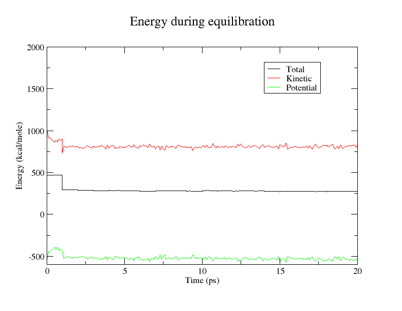\ 

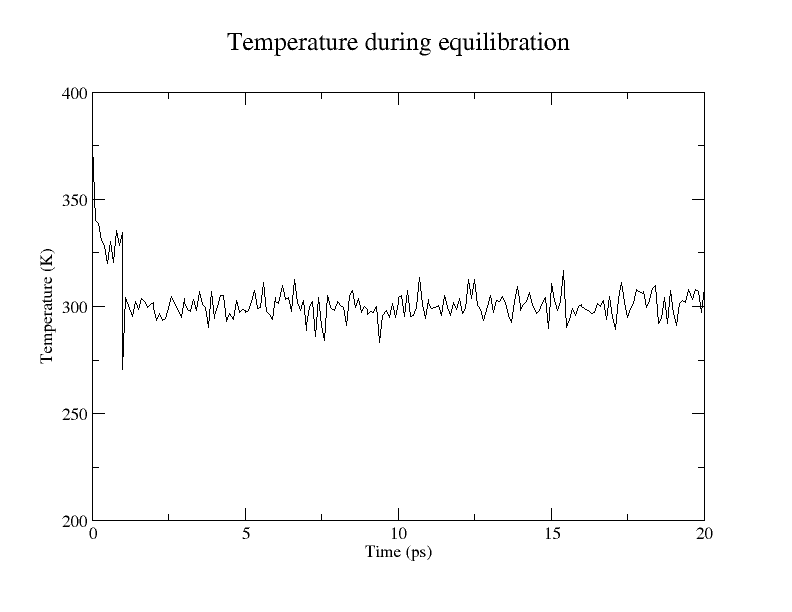\ 

>   Are temperature and energy stable?

Yes, mostly.

### Equilibration without rescaling velocities^[<http://www.bisb.uni-bayreuth.de/Lecture/practical/CharmmCourse/Skript/node22.html>]

*   Copied the required files to `equi2`.
*   Modified the input script.

```bash
$ pwd
/home/student10/practicum/equi2
$ git show -q | head -1
commit 3ff307b006f9fd1035aadfe6d566b72068c24bfa
$ charmm < equi2.inp > equi2.out
$ grep 'DYNA>' equi2.out > equi2.dat
$ awk '{print $3"    "$4}' equi2.dat > time-total.dat
$ awk '{print $3"    "$5}' equi2.dat > time-kinetic.dat
$ awk '{print $3"    "$6}' equi2.dat > time-potential.dat
$ awk '{print $3"    "$7}' equi2.dat > time-temp.dat
```

>   Why are the two equilibration steps necessary?

The second step ensures that the temperature won't change when simulating the system.

>   Plot the total, potential and kinetic energy and the temperature versus simulation
>   time.

```bash
$ xmgrace time-total.dat time-kinetic.dat time-potential.dat
$ xmgrace time-temp.dat
```

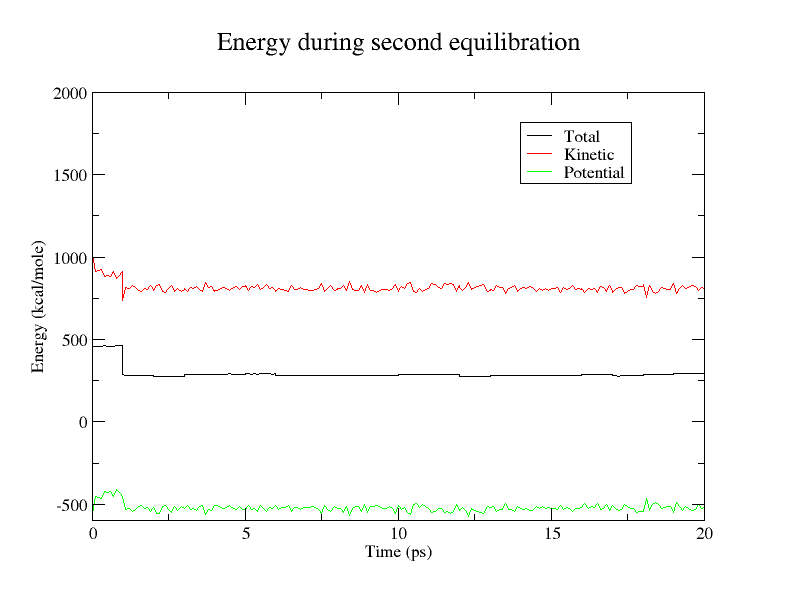\ 

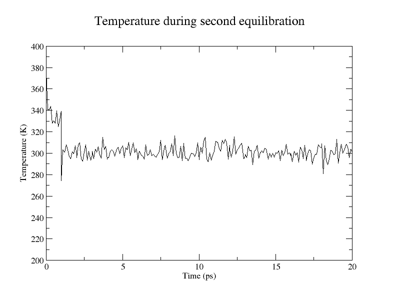\ 

>   Are temperature and energy stable?

Yeah, I guess.

## Production^[<http://www.bisb.uni-bayreuth.de/Lecture/practical/CharmmCourse/Skript/node23.html>]

```bash
$ pwd
/home/student10/practicum/prod
$ git show -q | head -1
commit b64037a75fa7c09fea240e909be4a2a71dceb096
$ charmm < prod.inp > prod.out
$ grep 'DYNA>' prod.out > prod.dat
$ awk '{print $3"    "$4}' prod.dat > time-total.dat
$ awk '{print $3"    "$5}' prod.dat > time-kinetic.dat
$ awk '{print $3"    "$6}' prod.dat > time-potential.dat
$ awk '{print $3"    "$7}' prod.dat > time-temp.dat
```

>   Analyze the output from the final run as before, i.e., plot total, potential and
>   kinetic energy, and temperature versus time.

```bash
$ xmgrace time-total.dat time-kinetic.dat time-potential.dat
$ xmgrace time-temp.dat
```

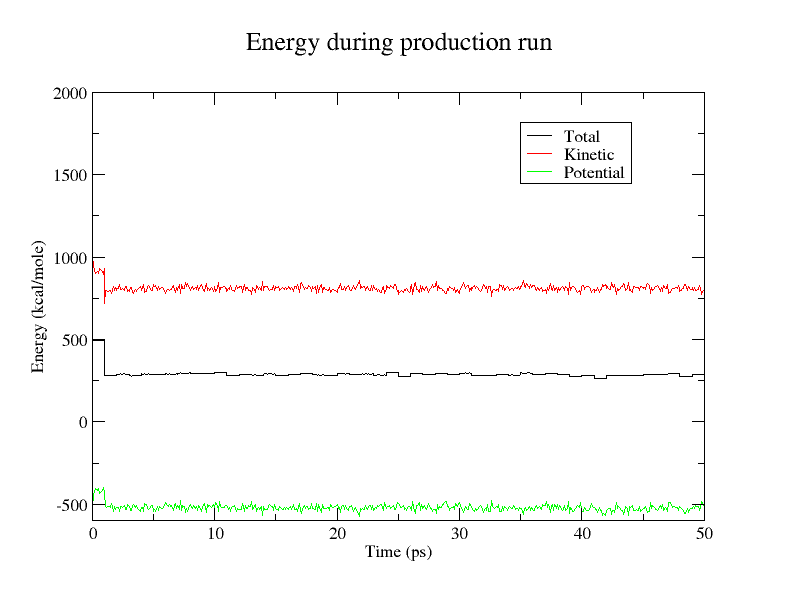\ 

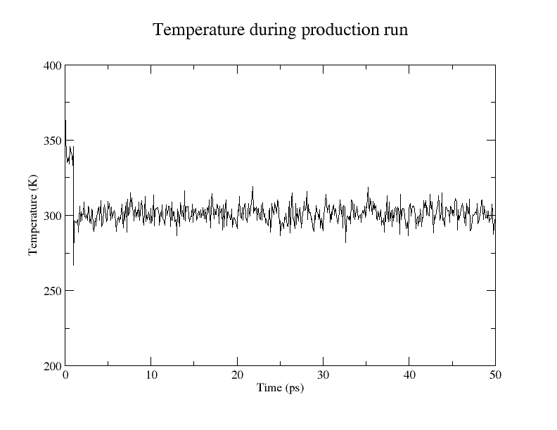\ 

>   Was the system stable during the entire run?

Yes.

### Analysis of Trajectories^[<http://www.bisb.uni-bayreuth.de/Lecture/practical/CharmmCourse/Skript/node24.html>]

Copied provided input scripts:

```bash
$ pwd
/home/student10/practicum/prod
$ mkdir ana
$ cp /home/ullmann/Lecture16/PraktMolmod/CharmmCourse/dyna/*.inp ana/
```

>   Plot out all time series vs time. The output files will consist of: column 1 =
>   trajectory time steps, column 2 = RMSD.

```bash
$ charmm < prot-rms.charmm.inp > prot-rms.charmm.out
$ charmm < bbone-rms.charmm.inp > bbone-rms.charmm.out
$ charmm < schain-rms.charmm.inp > schain-rms.charmm.out
$ xmgrace prot-rms.dat bbone-rms.dat schain-rms.dat
```

\ 

>   How do the RMSD of the backbone and sidechains compare to the RMSD of the whole
>   protein?

*   The RMSDs of the backbone are smaller than those of the whole protein.
*   The RMSDs of the side chains are bigger than those of the whole protein.

>   Compare with the results of the other students. How do the results vary with
>   temperature?

```bash
$ cp /home/student10/practicum/andi/CharmmCourse/dyna/RMSD_400K.png .
```

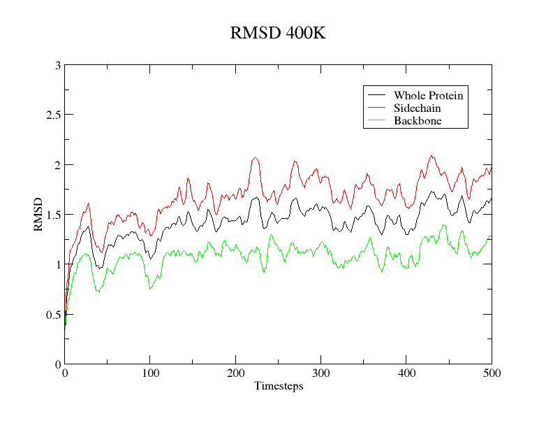\ 

*   At 400K, the RMSDs are bigger.

\ 

>   Which parts of the protein are more flexible? Use the vmd movie mode.

The side chains are more flexible.  See the GIF at 400K.


>   Plot out all time series vs time. The output files will consist of: column 1 =
>   simulation time (in ps), column 2 = time series of S-S distance, column 3 = time
>   series of C-S-S angle, column 4 = time series of C-S-S-C dihedral.

```bash
$ git show -q | head -1
commit 54b354a04fa01d1e35b362d96e4a04cb8d15d4c4
$ charmm < correl.charmm.inp  > correl.charmm.out
$ awk '{print $1"    "$2}' correl.dat > time-ss.dat
$ awk '{print $1"    "$3}' correl.dat > time-css.dat
$ awk '{print $1"    "$4}' correl.dat > time-cssc.dat
```

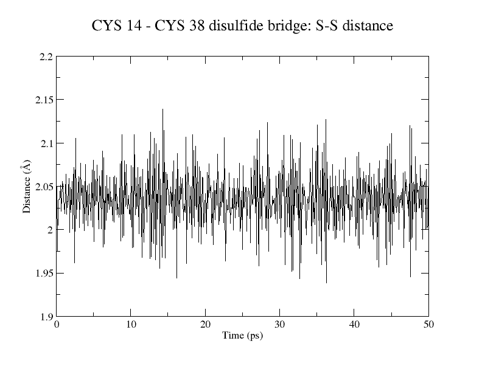\ 

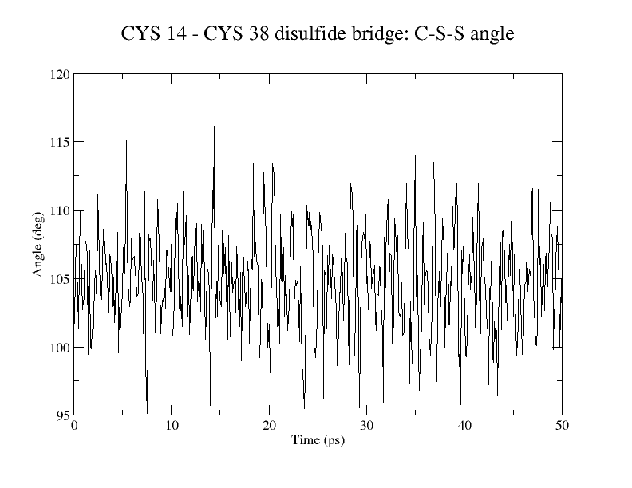\ 

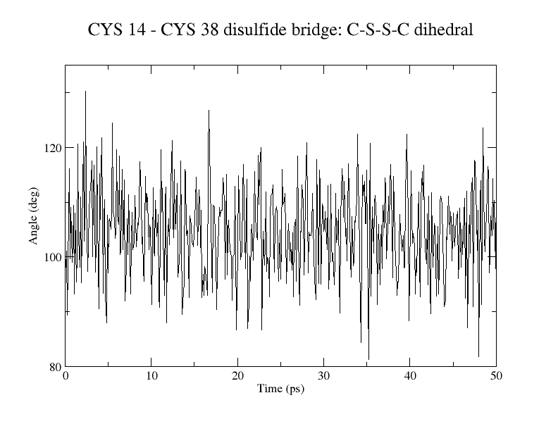\ 

>   What is the average value and standard deviation of the S-S distance, the C-S-S angle,
>   and the C-S-S-C dihedral angle? How may these values be interpreted ?

|                  | Average           | SD           |
|------------------+-------------------+--------------|
| S-S distance     | 2.03466044  Å     | 0.0365230212 |
| C-S-S angle      | 104.76354781 deg  | 3.6009645854 |
| C-S-S-C dihedral | 104.729799352 deg | 7.8910220214 |

Table: Averages and SDs of disulfide bridge properties

>   Why is the standard derivation `S-S` < `C-S-S` < `C-S-S-C`?

The length of the disulfide bridge is not very flexible.  Binding angles are more
flexible.  Dihedrals (rotation of atom groups around a bond) are even more flexible.

## Theoretical Background - Solvation^[<http://www.bisb.uni-bayreuth.de/Lecture/practical/CharmmCourse/Skript/node25.html>]

>   Explain the different water models (implicit and explicit).

Implicit:

*   Approximate forces caused by water without actually simulating individual H~2~O
    molecules.

Explicit:

*   Simulate water molecules.

<!-- <http://www.bisb.uni-bayreuth.de/Lecture/Slides/lecture-md.pdf#page=20> -->

>   What are the advantages and disadvantages of the two water models?

Implicit:

*   Cheap but less accurate.

Explicit:

*   Accurate but expensive.

>   What means periodic boundaries?

Define a *periodic cell* surrounded by copies of itself.  Atoms leaving one side of the
cell re-enter on the opposite side.

## Parallel Computing^[<http://www.bisb.uni-bayreuth.de/Lecture/practical/CharmmCourse/Skript/node26.html>]

<!-- x4 doesn't exist anymore -->

<!-- x3, x5, x2 -->

## Initialization^[<http://www.bisb.uni-bayreuth.de/Lecture/practical/CharmmCourse/Skript/node27.html>]

### Preparation of the water box^[<http://www.bisb.uni-bayreuth.de/Lecture/practical/CharmmCourse/Skript/node28.html>]

#### Generation of the water box^[<http://www.bisb.uni-bayreuth.de/Lecture/practical/CharmmCourse/Skript/node29.html>]

```bash
$ pwd
/home/student10/practicum/water
$ cp /home/ullmann/Lecture16/PraktMolmod/CharmmCourse/inputs/make_Wbox.pl .
$ cp ../min-disu.pdb .
$ # Created `coor-stat.inp`.
$ charmm < coor-stat.inp | grep 'coor stat' -A 4
 CHARMM>    coor stat
 STATISTICS FOR  904 SELECTED ATOMS:
    XMIN =   16.825000 XMAX =   44.009000 XAVE =   28.534252
    YMIN =   -3.790000 YMAX =   23.421000 YAVE =    9.399907
    ZMIN =  -16.222000 ZMAX =   16.720000 ZAVE =    0.529814
$ bc <<< '44.009000 - 16.825000'
27.184000
$ bc <<< '23.421000 - (-3.790000)'
27.211000
$ bc <<< '16.720000 - (-16.222000)'
32.942000
$ ./make_Wbox.pl 34 34 39 > box.pdb # x_dim=34, y_dim=34, z_dim=39
```

>   What is the density of your water box?

```bash
$ git show -q | head -1
commit 184d561e8c0dd8fdf9fc35986b4d40fbf73ca71b
$ head -1 box.pdb
placed 1452 in box instead of 1556 molecules. Error : 6.673 %
```

Density:

\begin{align*}
    & \frac{1452 \cdot 18 \frac{g}{\text{mole}}}
         {6.022 \cdot 10^{23} \frac{1}{\text{mole}} \cdot 34Å \cdot 34Å \cdot 39Å} \\
    =\ & \frac{26136 g}
         {6.022 \cdot 10^{23} \cdot 45084 \cdot 10^{-30} m^3} \\
    =\ & 0.096267 \cdot 10^7 \frac{g}{m^3} \\
    =\ & 0.96267 \frac{g}{cm^3}
\end{align*}

#### Periodic boundary conditions^[<http://www.bisb.uni-bayreuth.de/Lecture/practical/CharmmCourse/Skript/node30.html>]

Deleted the first 4 lines from `box.pdb` because they make no sense:

```bash
$ git checkout 184d561e8c0dd8fdf9fc35986b4d40fbf73ca71b box.pdb
$ head -4 box.pdb
placed 1452 in box instead of 1556 molecules. Error : 6.673 %
0.00
ATOM      2  H1  TIP3     1    -17.140 -17.760 -20.060  1.00  0.00
ATOM      3  H2  TIP3     1    -17.295 -15.920 -20.020  1.00  0.00
```

Appended `END` to to `box.pdb`.  Adjusted the [atom serial numbers][ATOM] and [residue
sequence numbers][ATOM] in `box.pdb` to start with 1.

Spent two and a half hours to find out that a different version of CHARMM has to be used
here:

```bash
$ alias charmm32='/sw/sci/app/charmm_64/c32b1/exec/gnu/charmm'
```

Minimized the water:

[ATOM]: http://deposit.rcsb.org/adit/docs/pdb_atom_format.html#ATOM
<!-- [ATOM]: http://www.wwpdb.org/documentation/file-format-content/format33/sect9.html#ATOM -->

<!--
Main console display active (Tcl8.5.6 / Tk8.5.6)
(water) 1 % set all [atomselect top all]
atomselect0
>Main< (water) 2 % measure center $all
-1.7850970029830933 -1.533324956893921 -2.964118480682373
>Main< (water) 3 % >
-->

```bash
$ git show -q | head -1
commit f413bb1582bc50742b4cc22464b7dc03daa36f97
charmm32 < min-box.inp > min-box.out
```

Heated the water:

```bash
$ git show -q | head -1
commit e0ab2361584ac7fe89a1c5ffb78fe7af83825c2f
charmm32 < heat-box.inp > heat-box.out
$ grep 'DYNA>' heat-box.out > heat-box.dat
$ awk '{print $3,$4}' heat-box.dat > time-total.dat
$ awk '{print $3,$5}' heat-box.dat > time-kinetic.dat
$ awk '{print $3,$6}' heat-box.dat > time-potential.dat
$ awk '{print $3,$7}' heat-box.dat > time-temp.dat
$ xmgrace time-total.dat time-kinetic.dat time-potential.dat 
$ xmgrace time-temp.dat
```

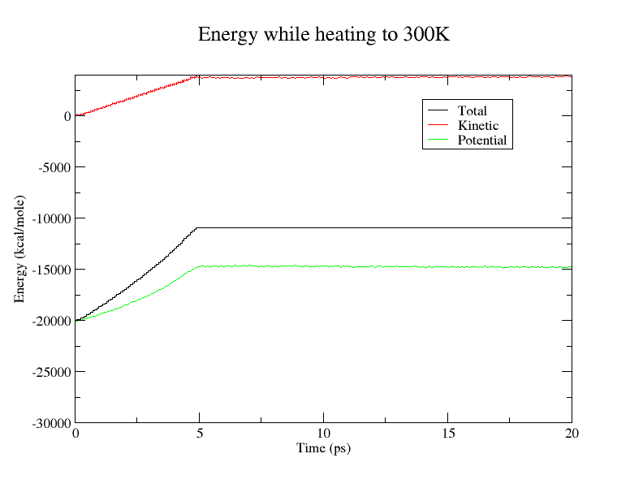\ 

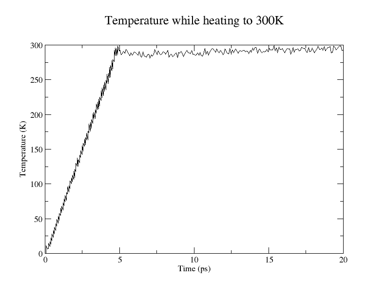\ 

>   What could happen, if the `Byres` key word is replaced by `byatoms`?

The `byatoms` keyword "[will not work if there are any bonds][charmm image]".

[charmm image]: https://www.charmm.org/charmm/documentation/by-version/c40b1/params/doc/images/#Centering

#### Equilibration of the water box^[<http://www.bisb.uni-bayreuth.de/Lecture/practical/CharmmCourse/Skript/node31.html>]

```bash
$ pwd
/home/student10/practicum/water/equi-box
$ git show -q | head -1
commit 1221a9bd2a437589b55c8f9c811a3af8e95dd8be
$ charmm32 < equi-box.inp > equi-box.out
$ git show -q | head -1
commit 981611e4bb60a72f5a4138d39cc8715b45366369
$ charmm32 < equi2-box.inp > equi2-box.out
```

### Preparation of BPTI^[<http://www.bisb.uni-bayreuth.de/Lecture/practical/CharmmCourse/Skript/node32.html>]

### Solvation of BPTI^[<http://www.bisb.uni-bayreuth.de/Lecture/practical/CharmmCourse/Skript/node33.html>]

```bash
$ git show -q | head -1
commit 0b0db04f51a4a2329078e90c1698b64daeb5a0ad
$ # XXX: use CHARMM 28!
$ charmm < combine.inp > combine.out
```

### Minimization of the system^[<http://www.bisb.uni-bayreuth.de/Lecture/practical/CharmmCourse/Skript/node34.html>]

```bash
$ git show -q | head -1
commit aab6f378da722191b6c968d61d3a32d4e53d3f11
$ # XXX: use CHARMM 32!
$ charmm32 < min.inp > min.out
$ vmd combined-min.pdb 
```

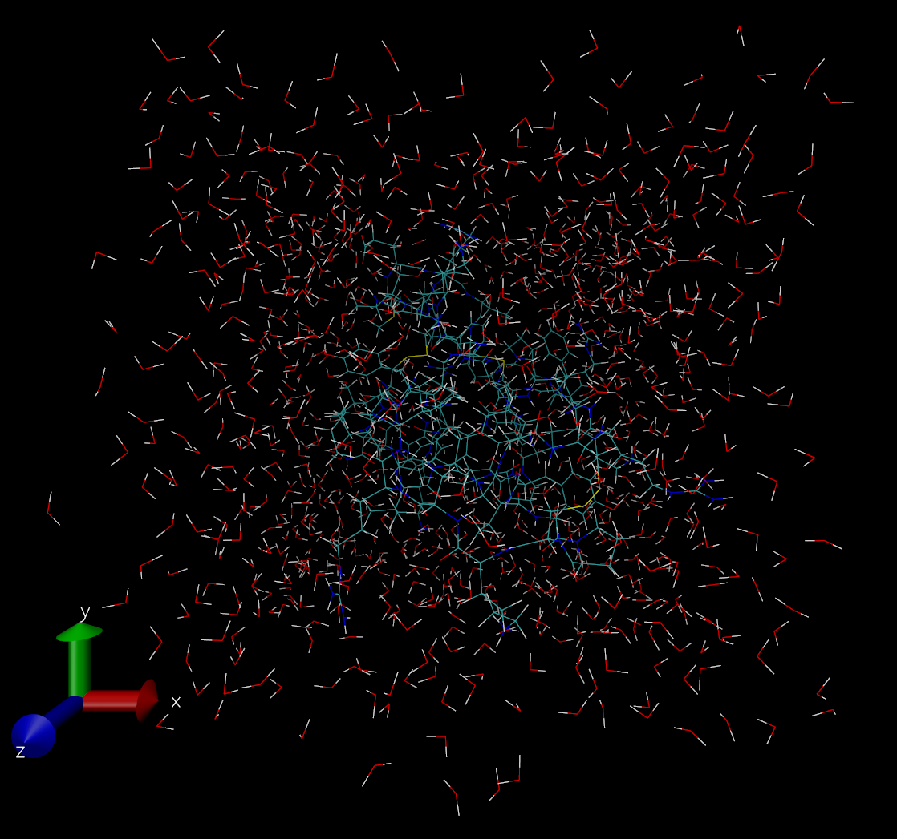

## Heating^[<http://www.bisb.uni-bayreuth.de/Lecture/practical/CharmmCourse/Skript/node35.html>]

```bash
$ git show -q | head -1
commit 3f89aaeb6bcaf844d2542f6d9f052c19bd7e405b
$ # XXX: use CHARMM 32!
$ charmm32 < heat.inp > heat.out
```

## Equilibration^[<http://www.bisb.uni-bayreuth.de/Lecture/practical/CharmmCourse/Skript/node36.html>]

```bash
$ pwd
/home/student10/practicum/water/combined
$ git show -q | head -1
commit bf9fece3411fc1560d4f440cc4596ea3015c2e30
$ # XXX: use CHARMM 32!
$ charmm32 < equi.inp > equi.out # first equilibration
$ git show -q | head -1
commit 93614bc5bf9afe991d334c16bd19fed9a5a2e4a5
$ # XXX: use CHARMM 32!
$ charmm32 < equi2.inp > equi2.out # second equilibration
```

>   Show that your system is stable.

```bash
$ grep 'DYNA>' equi2.out > equi2.dat
$ awk '{print $3,$4}' equi2.dat > time-total.dat
$ awk '{print $3,$5}' equi2.dat > time-kinetic.dat
$ awk '{print $3,$6}' equi2.dat > time-potential.dat
$ awk '{print $3,$7}' equi2.dat > time-temp.dat
$ xmgrace time-total.dat time-kinetic.dat time-potential.dat
```

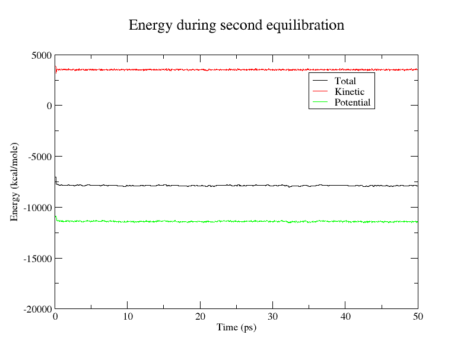\ 

Looks pretty stable.

## Production^[<http://www.bisb.uni-bayreuth.de/Lecture/practical/CharmmCourse/Skript/node37.html>]

```bash
$ git show -q | head -1
commit 9cc3576779d8d71dd3f57c1b331bf2f990f0a7ba
$ # XXX: use CHARMM 32!
$ charmm32 < prod.inp > prod.out
```

>   Analyze the RMSD values of the backbone and side chain atoms. 

```bash
$ pwd
/home/student10/practicum/water/combined/prod
$ mkdir ana
$ cp ../../../prod/ana/*.inp ana/
$ cd ana
$ charmm32 < prot-rms.charmm.inp > prot-rms.charmm.out
$ charmm32 < bbone-rms.charmm.inp > bbone-rms.charmm.out
$ charmm32 < schain-rms.charmm.inp > schain-rms.charmm.out
$ xmgrace prot-rms.dat bbone-rms.dat schain-rms.dat
```

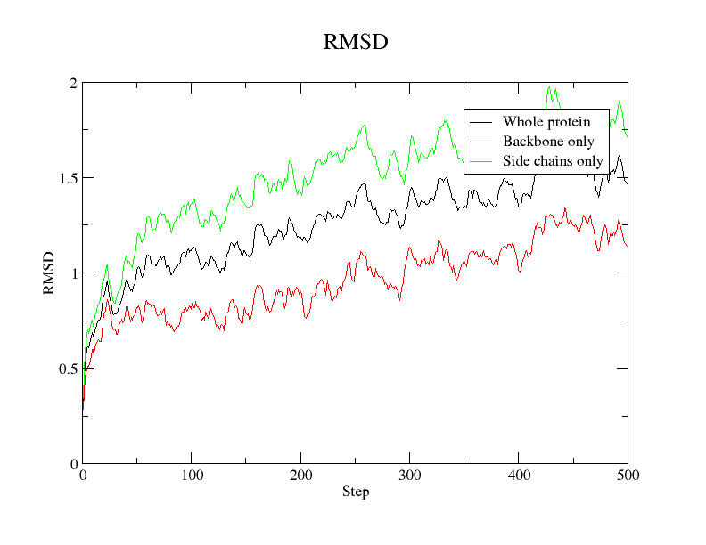\ 

For reference, the RMSD values at 300K without water again:

\ 

>   Analyze the time series of the disulfide bridge Cys-14 and Cys-38 as before. 

**TODO.**

>   Compare the here calculated RMSD values and the time series of side chain atoms with
>   the ones from the vacuum simulation. 

**TODO.**

# MEAD^[<http://www.bisb.uni-bayreuth.de/Lecture/practical/MeadCourse/index.html>]

```bash
$ ln -s ~/practicum/mead/mead-2.2.8a/apps/multiflex/multiflex ~/bin/
$ ln -s ~/practicum/mcti/src/mcti ~/bin/
```

## Installation and introduction to MEAD and mcti^[<http://www.bisb.uni-bayreuth.de/Lecture/practical/MeadCourse/installation_MBexample/installation_MBexample.html>]

>   What is MEAD, and what is its purpose?

MEAD is a collection of C++ programs for modeling the electrostatics of molecules.

>   Shortly explain what you did to get the executables.

Download and compile source code.

>   What does multiflex do? Limit your explanation to single-conformer calculations.
>
>   *   What information is contained in the different input files?
>
>   *   What is the histidine tautomerism problem mentioned in the myoglobin README file?

>   Shortly list the different steps required to characterise the titration behaviour of
>   myoglobin.

>   List those titratable sites of myoglobin with pK½-values in the physiological range
>   (pH5 to 9).
>
>   *   Display their titration curves using xmgrace.
>
>   *   When you look at curves.out you will realise that collect_curves.pl does not
>       output protonation probabilities if they are 1 or 0. Please don't bother about
>       this feature.

>   Try to understand what the different columns in the histidine sections of 'curves.out' represent.
>
>   *   What is the predominant protonation and/or tautomer state of His24 and His119 at
>       pH2 and pH10?
>
>   *   Can you give a structural reason for their behaviour? Don't bother about the
>       rather colourful representation of the pqr-file in rasmol.

[^node9]: http://www.bisb.uni-bayreuth.de/Lecture/practical/CharmmCourse/Skript/node9.html

[1BPI]: http://www.rcsb.org/pdb/explore/explore.do?structureId=1BPI

[top_all27_prot_lipid.rtf]: top_all27_prot_lipid.rtf
[par_all27_prot_lipid.prm]: par_all27_prot_lipid.prm

<!-- vim: set tw=90 sts=-1 sw=4 et spell: -->
